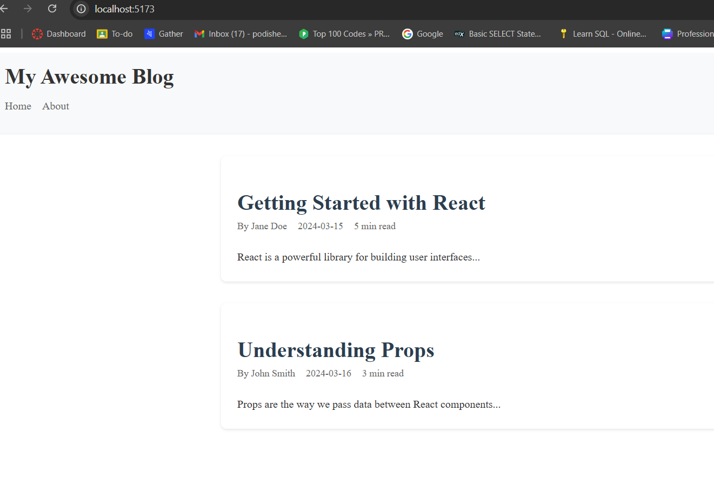

# challenge_react_project
## Assignment-1
## Components Structure
- BlogPost: Displays an individual blog post, including the title, author, date, read time, and content.
- BlogList: Acts as a container for multiple BlogPost components, iterating over the posts array and displaying each post.
- Header: Serves as the navigation bar or site header, displaying the site title or links.

## New Features
- PropTypes for Type Safety: PropTypes are used to enforce the types and requirements of each prop passed to BlogPost and BlogList, ensuring valid data for each post.
- Dynamic Blog List Rendering: Implemented dynamic rendering of blog posts by mapping through the posts array in BlogList, which takes data from a centralized posts file.

## Screenshots
